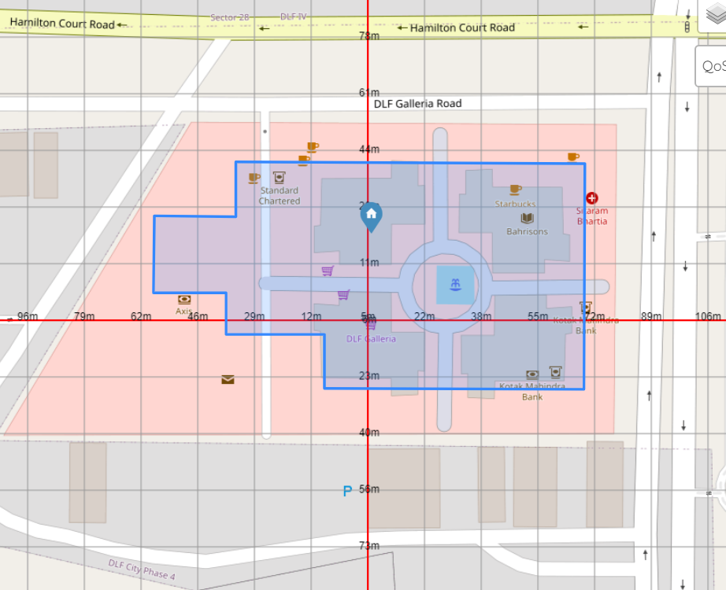

# AxesLayerWithDistance

[](https://badge.fury.io/js/axes-layer-with-distance)
[](https://opensource.org/licenses/MIT)

**AxesLayerWithDistance** is a custom Leaflet grid layer that displays a customizable grid with labeled axes on a Leaflet map. This library allows you to visualize distance scales directly on your map tiles, enhancing the map's usability and interactivity for educational, scientific, or navigational purposes.

## Features

- **Customizable Grid**: Configure the number of cells, color, and size of grid lines.
- **Axes Labels**: Show distance labels on the axes in meters or kilometers.
- **Dynamic Centering**: Set and update the center of the grid dynamically.
- **SVG Rendering**: Utilizes SVG for sharp and scalable graphics.

## Demo



## Installation

Install the package via npm:

```bash
npm install axes-layer-with-distance

```

## Usage
First, import the library and Leaflet into your project:

```
import * as L from 'leaflet';
import { AxesLayer, AxesLayerOptions } from 'axes-layer-with-distance';

```

## Create a Map and Add the Layer

Here is a simple example of how to create a Leaflet map and add the `AxesLayerWithDistance`:

```
// Create a map
const map = L.map('map').setView([51.505, -0.09], 13);

// Add a tile layer (e.g., OpenStreetMap)
L.tileLayer('https://{s}.tile.openstreetmap.org/{z}/{x}/{y}.png', {
  maxZoom: 19,
}).addTo(map);

// Create an AxesLayer with options
const axesLayer = AxesLayer({
  cells: 5,
  color: '#40404044',
  axesColor: '#ff6754',
  axesWidth: 0.8,
  zoom: 10,
  showLabel: true,
  defaultLabel: {
    color: '#404040',
    size: 13,
  },
  center: { lat: 51.505, lng: -0.09 },
});

// Add the AxesLayer to the map
axesLayer.addTo(map);


```

## Options
You can customize the AxesLayerWithDistance using the following options:

- **cells**: Number of grid cells per tile. Default is 5.
- **color** : Color of the grid lines. Supports any CSS color value. Default is '#40404044'.
- **axesColor**: Color of the main axes lines. Default is '#ff6754'.
- **axesWidth**: Width of the axes lines in pixels. Default is 0.8.
- **zoom**: Initial zoom level when adding the layer. Default is 10.
- **showLabel**: Boolean to show/hide distance labels. Default is false.
- **defaultLabel.color**: Color of the text labels. Default is '#404040'.
- **defaultLabel.size**: Font size of the text labels. Default is 13.
- **center**: The center of the grid, specified as a L.LatLngLiteral with latitude and longitude.

## Methods
- **setCenter(center: L.LatLngExpression)**: void: Updates the center of the grid and redraws the layer.

## Advanced Example

Here is a more advanced usage scenario, including event handling and dynamic updates:

```
// Create a map with an initial view
const map = L.map('map').setView([40.7128, -74.0060], 12);

// Add OpenStreetMap tile layer
L.tileLayer('https://{s}.tile.openstreetmap.org/{z}/{x}/{y}.png', {
  attribution: '&copy; OpenStreetMap contributors',
  maxZoom: 18,
}).addTo(map);

// Configure the AxesLayer options
const options = {
  cells: 6,
  color: '#00000044',
  axesColor: '#008000',
  axesWidth: 1.2,
  zoom: 12,
  showLabel: true,
  defaultLabel: {
    color: '#008000',
    size: 14,
  },
  center: { lat: 40.7128, lng: -74.0060 },
};

// Initialize the AxesLayer
const axesLayer = AxesLayer(options);

// Add the AxesLayer to the map
axesLayer.addTo(map);

// Update the grid center dynamically
map.on('click', (event) => {
  axesLayer.setCenter(event.latlng);
  console.log('Grid center updated:', event.latlng);
});

```

## Contributing
We welcome contributions to improve this library. Please fork the repository, create a branch, and submit a pull request with your changes.

## License
This project is licensed under the MIT [License](https://opensource.org/license/mit). See the LICENSE file for details.


## Questions and Support
For any questions or support requests, please open an issue on the GitHub repository or contact me directly at techyared.main@gmail.com.